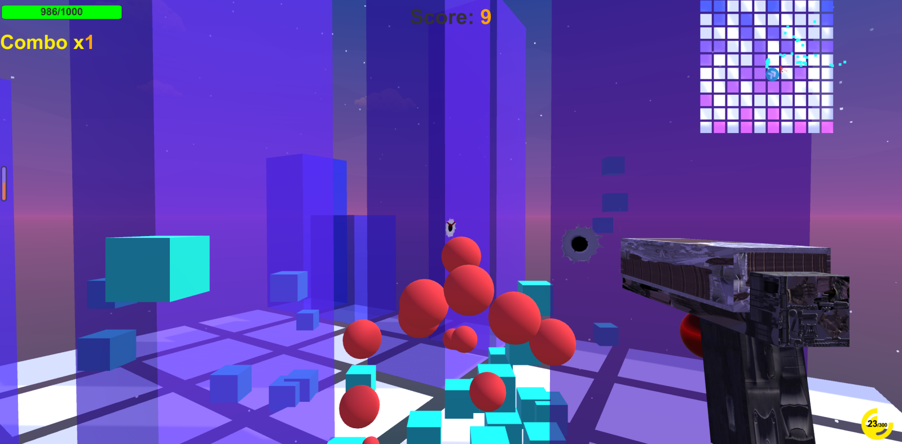

# Maze Chasing

### Intro
A level-based first-person shooter (FPS) game with randomly generated maze-like maps.

Maze Chasing is a small-scale single-player FPS game with level-based gameplay. Each level generates a non-enclosed map resembling a maze using the flood fill algorithm with blocks as obstacles. The map parameters can be modified through a configuration file(.\MazeChasing_Data\StreamingAssets\MapsData.json or .\Assets\StreamingAssets\MapsData.json if you clone the source code). The game features interchangeable weapons and ammunition, as well as a scoring system.

Enemies are randomly spawned at various locations after warnings beforehand, managed by a finite state machine. They automatically pathfind towards the player and engage in shooting once the player is within their attack range and there are no obstacles in the line of fire. Enemy states include chasing, attacking, and retreating. The level difficulty, including enemy quantity, health, attack power, spawn intervals, and movement speed, can also be adjusted via the configuration file(.\MazeChasing_Data\StreamingAssets\WavesData.json or .\Assets\StreamingAssets\WavesData.json if you clone the source code).

To progress, the player must eliminate all enemies in the current level. Game over occurs if the player is killed or falls out of the scene. Each subsequent level increases in difficulty, with larger maps and more challenging enemy encounters.

Regarding the crosshair, it is positioned in the center and ensures that bullets fired from the gun hit exactly where the crosshair is pointing, without any deviation. This is achieved by using a separate camera for the gun system and placing the gun directly in front of the main camera.

### Control
- Arrow keys for movement
- Spacebar for jumping
- U for changing ammunition
- C for changing weapons
- Tab for showing or hiding the mini-map

### Showcase
Dynamic UI displaying the current wave number at the start of each wave, player health displayed in the top left corner, current score in the middle top, a mini-map in the top right corner, bullet count in the bottom right corner, and a central crosshair.

Bullet impact effects: bullet holes and sparks splashing on obstacles; red blinking blocks indicate the position of the next enemy.

The combo displayed in the top left corner shows the number of consecutive hits. The higher the combo, the more points earned.

Blood splatter effects when enemies are hit, as well as special effects upon enemy death.

Wave cleaned UI, adn animation for reloading the gun.

Enemy health UI and mini-map UI for the enemies.

Player victory and defeat.

